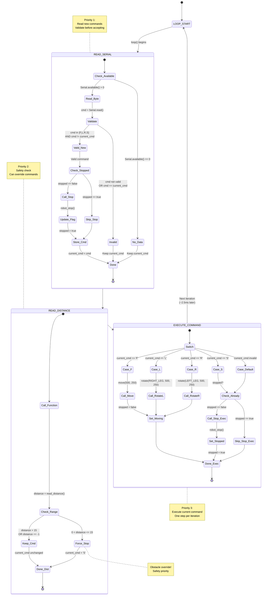
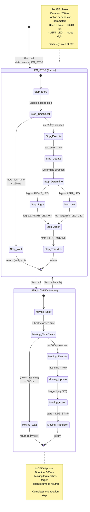
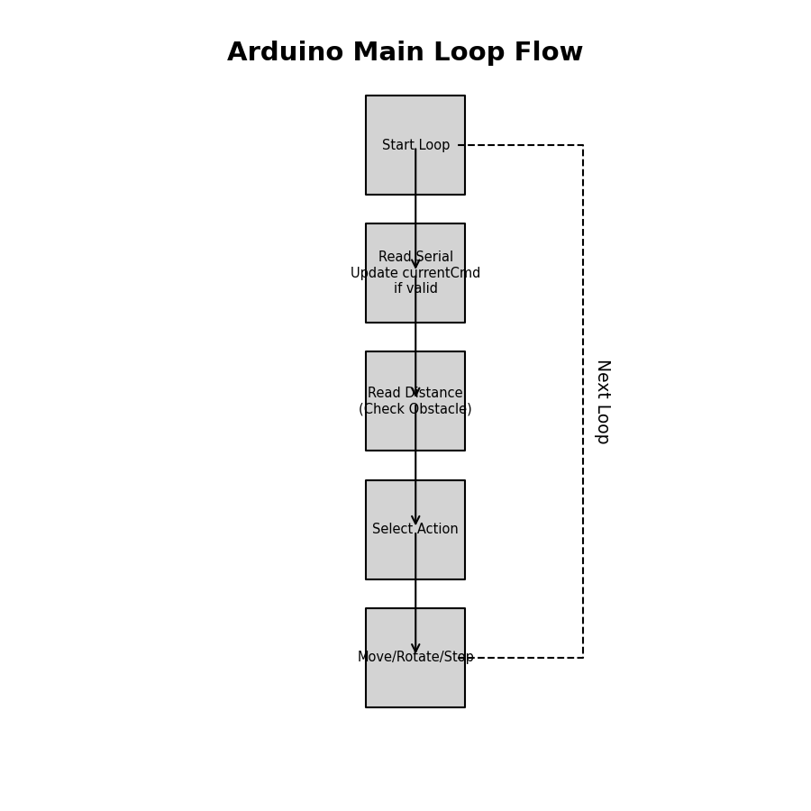

# Complete Robot System - Finite State Machine Documentation

## Overview
This document provides a **complete finite state machine** representation of the entire robot system, showing how all components work together from power-on to execution.

---

## Table of Contents
1. System-Level FSM (Robot.ino + Robot.cpp integrated)
2. Arduino Main Loop FSM (Robot.ino)
3. Movement Sub-FSMs (Robot.cpp)
4. State Transition Tables
5. Timing Diagrams

---

## 1) System-Level FSM (Complete System)

This is the **master finite state machine** showing the entire robot behavior:

```mermaid
stateDiagram-v2
  [*] --> POWER_ON

  POWER_ON --> INITIALIZING: Arduino starts

  state INITIALIZING {
    [*] --> Attach_Servos
    Attach_Servos --> Setup_Ultrasonic: R_leg_setup(9)<br/>L_leg_setup(10)
    Setup_Ultrasonic --> Init_Serial: ultrsnc_head_setup(12,11)
    Init_Serial --> Stop_Robot: Serial.begin(115200)
    Stop_Robot --> Ready: robot_stop()<br/>stopped = true<br/>current_cmd = 0
    Ready --> [*]
  }

  INITIALIZING --> IDLE

  state IDLE {
    [*] --> Monitor
    Monitor --> Check_Serial: loop() iteration
    Check_Serial --> Check_Obstacle: Read distance
    Check_Obstacle --> Execute: Determine action
    Execute --> [*]
    
    note right of Monitor
      State variables:
      - current_cmd = 0 or 'S'
      - stopped = true
      - Both legs at 90°
    end note
  }

  IDLE --> WALKING: Serial 'F'<br/>current_cmd = 'F'
  IDLE --> ROTATING_LEFT: Serial 'L'<br/>current_cmd = 'L'
  IDLE --> ROTATING_RIGHT: Serial 'R'<br/>current_cmd = 'R'
  IDLE --> IDLE: Serial 'S'<br/>current_cmd = 'S'

  state WALKING {
    [*] --> Walk_Init
    Walk_Init --> Walk_LEFT_STOP: stopped = false
    
    state Walk_LEFT_STOP {
      [*] --> Check_Time_LS
      Check_Time_LS --> Wait_LS: time < 250ms
      Wait_LS --> [*]: return
      Check_Time_LS --> Action_LS: time >= 250ms
      Action_LS --> Move_Right: leg_act(RIGHT_LEG, 0°)
      Move_Right --> Next_LS: state = RIGHT_MOVING
      Next_LS --> [*]
    }
    
    Walk_LEFT_STOP --> Walk_RIGHT_MOVING
    
    state Walk_RIGHT_MOVING {
      [*] --> Check_Time_RM
      Check_Time_RM --> Wait_RM: time < 500ms
      Wait_RM --> [*]: return
      Check_Time_RM --> Action_RM: time >= 500ms
      Action_RM --> Stop_Right: leg_act(RIGHT_LEG, 90°)
      Stop_Right --> Next_RM: state = RIGHT_STOP
      Next_RM --> [*]
    }
    
    Walk_RIGHT_MOVING --> Walk_RIGHT_STOP
    
    state Walk_RIGHT_STOP {
      [*] --> Check_Time_RS
      Check_Time_RS --> Wait_RS: time < 250ms
      Wait_RS --> [*]: return
      Check_Time_RS --> Action_RS: time >= 250ms
      Action_RS --> Move_Left: leg_act(LEFT_LEG, 180°)
      Move_Left --> Next_RS: state = LEFT_MOVING
      Next_RS --> [*]
    }
    
    Walk_RIGHT_STOP --> Walk_LEFT_MOVING
    
    state Walk_LEFT_MOVING {
      [*] --> Check_Time_LM
      Check_Time_LM --> Wait_LM: time < 500ms
      Wait_LM --> [*]: return
      Check_Time_LM --> Action_LM: time >= 500ms
      Action_LM --> Stop_Left: leg_act(LEFT_LEG, 90°)
      Stop_Left --> Next_LM: state = LEFT_STOP
      Next_LM --> [*]
    }
    
    Walk_LEFT_MOVING --> Walk_LEFT_STOP
    
    note right of Walk_LEFT_STOP
      Total cycle: 1500ms
      - Pause 250ms
      - Right leg moves 500ms
      - Pause 250ms
      - Left leg moves 500ms
    end note
  }

  state ROTATING_LEFT {
    [*] --> RotL_Init
    RotL_Init --> RotL_LEG_STOP: stopped = false
    
    state RotL_LEG_STOP {
      [*] --> Check_Time_RLS
      Check_Time_RLS --> Wait_RLS: time < 250ms
      Wait_RLS --> [*]: return
      Check_Time_RLS --> Action_RLS: time >= 250ms
      Action_RLS --> Move_Right_Leg: leg_act(RIGHT_LEG, 0°)<br/>left leg stays 90°
      Move_Right_Leg --> Next_RLS: state = LEG_MOVING
      Next_RLS --> [*]
    }
    
    RotL_LEG_STOP --> RotL_LEG_MOVING
    
    state RotL_LEG_MOVING {
      [*] --> Check_Time_RLM
      Check_Time_RLM --> Wait_RLM: time < 500ms
      Wait_RLM --> [*]: return
      Check_Time_RLM --> Action_RLM: time >= 500ms
      Action_RLM --> Stop_Right_Leg: leg_act(RIGHT_LEG, 90°)
      Stop_Right_Leg --> Next_RLM: state = LEG_STOP
      Next_RLM --> [*]
    }
    
    RotL_LEG_MOVING --> RotL_LEG_STOP
    
    note right of RotL_LEG_STOP
      Total cycle: 750ms
      - Pause 250ms
      - Right leg moves 500ms
      - Robot pivots left
    end note
  }

  state ROTATING_RIGHT {
    [*] --> RotR_Init
    RotR_Init --> RotR_LEG_STOP: stopped = false
    
    state RotR_LEG_STOP {
      [*] --> Check_Time_RRS
      Check_Time_RRS --> Wait_RRS: time < 250ms
      Wait_RRS --> [*]: return
      Check_Time_RRS --> Action_RRS: time >= 250ms
      Action_RRS --> Move_Left_Leg: leg_act(LEFT_LEG, 180°)<br/>right leg stays 90°
      Move_Left_Leg --> Next_RRS: state = LEG_MOVING
      Next_RRS --> [*]
    }
    
    RotR_LEG_STOP --> RotR_LEG_MOVING
    
    state RotR_LEG_MOVING {
      [*] --> Check_Time_RRM
      Check_Time_RRM --> Wait_RRM: time < 500ms
      Wait_RRM --> [*]: return
      Check_Time_RRM --> Action_RRM: time >= 500ms
      Action_RRM --> Stop_Left_Leg: leg_act(LEFT_LEG, 90°)
      Stop_Left_Leg --> Next_RRM: state = LEG_STOP
      Next_RRM --> [*]
    }
    
    RotR_LEG_MOVING --> RotR_LEG_STOP
    
    note right of RotR_LEG_STOP
      Total cycle: 750ms
      - Pause 250ms
      - Left leg moves 500ms
      - Robot pivots right
    end note
  }

  WALKING --> STOPPING: New command<br/>or obstacle
  ROTATING_LEFT --> STOPPING: New command<br/>or obstacle
  ROTATING_RIGHT --> STOPPING: New command<br/>or obstacle

  state STOPPING {
    [*] --> Call_Stop
    Call_Stop --> Stop_Right_Leg: robot_stop()
    Stop_Right_Leg --> Stop_Left_Leg: leg_act(RIGHT_LEG, 90°)
    Stop_Left_Leg --> Set_Flag: leg_act(LEFT_LEG, 90°)
    Set_Flag --> Done: stopped = true
    Done --> [*]
  }

  STOPPING --> IDLE: Ready for<br/>next command

  note left of POWER_ON
    Entry point
    Arduino boot sequence
  end note

  note right of WALKING
    State variables:
    - current_cmd = 'F'
    - stopped = false
    - Static state persists
      across loop() calls
  end note

  note right of ROTATING_LEFT
    State variables:
    - current_cmd = 'L'
    - stopped = false
    - Only right leg moves
  end note

  note right of ROTATING_RIGHT
    State variables:
    - current_cmd = 'R'
    - stopped = false
    - Only left leg moves
  end note
```



---

## 2) Arduino Main Loop FSM (Robot.ino)

This shows the high-level control logic in `loop()`:



---

## 3) Movement Sub-FSMs (Robot.cpp)

### 3.1) move() Function - Forward Walking FSM

```mermaid
stateDiagram-v2
  [*] --> LEFT_STOP: First call<br/>static state = LEFT_STOP

  state "LEFT_STOP (Pause)" as LEFT_STOP {
    [*] --> LS_Entry
    LS_Entry --> LS_TimeCheck: Check elapsed time
    LS_TimeCheck --> LS_Wait: (now - last_time)<br/>< 250ms
    LS_Wait --> [*]: return (early exit)
    LS_TimeCheck --> LS_Execute: >= 250ms elapsed
    LS_Execute --> LS_Update: last_time = now
    LS_Update --> LS_Action: leg_act(RIGHT_LEG, 0°)
    LS_Action --> LS_Transition: state = RIGHT_MOVING
    LS_Transition --> [*]: return
  }

  state "RIGHT_MOVING (Motion)" as RIGHT_MOVING {
    [*] --> RM_Entry
    RM_Entry --> RM_TimeCheck: Check elapsed time
    RM_TimeCheck --> RM_Wait: (now - last_time)<br/>< 500ms
    RM_Wait --> [*]: return (early exit)
    RM_TimeCheck --> RM_Execute: >= 500ms elapsed
    RM_Execute --> RM_Update: last_time = now
    RM_Update --> RM_Action: leg_act(RIGHT_LEG, 90°)
    RM_Action --> RM_Transition: state = RIGHT_STOP
    RM_Transition --> [*]: return
  }

  state "RIGHT_STOP (Pause)" as RIGHT_STOP {
    [*] --> RS_Entry
    RS_Entry --> RS_TimeCheck: Check elapsed time
    RS_TimeCheck --> RS_Wait: (now - last_time)<br/>< 250ms
    RS_Wait --> [*]: return (early exit)
    RS_TimeCheck --> RS_Execute: >= 250ms elapsed
    RS_Execute --> RS_Update: last_time = now
    RS_Update --> RS_Action: leg_act(LEFT_LEG, 180°)
    RS_Action --> RS_Transition: state = LEFT_MOVING
    RS_Transition --> [*]: return
  }

  state "LEFT_MOVING (Motion)" as LEFT_MOVING {
    [*] --> LM_Entry
    LM_Entry --> LM_TimeCheck: Check elapsed time
    LM_TimeCheck --> LM_Wait: (now - last_time)<br/>< 500ms
    LM_Wait --> [*]: return (early exit)
    LM_TimeCheck --> LM_Execute: >= 500ms elapsed
    LM_Execute --> LM_Update: last_time = now
    LM_Update --> LM_Action: leg_act(LEFT_LEG, 90°)
    LM_Action --> LM_Transition: state = LEFT_STOP
    LM_Transition --> [*]: return
  }

  LEFT_STOP --> RIGHT_MOVING: Next call
  RIGHT_MOVING --> RIGHT_STOP: Next call
  RIGHT_STOP --> LEFT_MOVING: Next call
  LEFT_MOVING --> LEFT_STOP: Next call (cycle)

  note left of LEFT_STOP
    PAUSE phase
    Duration: 250ms
    Action: Move right leg
    
    Call count: Multiple
    State persists via static
  end note

  note right of RIGHT_MOVING
    MOTION phase
    Duration: 500ms
    Action: Right leg moving
    
    Other leg: stationary
  end note

  note left of RIGHT_STOP
    PAUSE phase
    Duration: 250ms
    Action: Move left leg
  end note

  note right of LEFT_MOVING
    MOTION phase
    Duration: 500ms
    Action: Left leg moving
    
    Completes one full step
  end note
```



### 3.2) rotate() Function - Rotation FSM



---

## 4) State Transition Tables

### 4.1) Main System States

| Current State | Input/Condition | Next State | Action |
|---|---|---|---|
| **IDLE** | Serial 'F' | WALKING | `current_cmd = 'F'`, `stopped = false` |
| **IDLE** | Serial 'L' | ROTATING_LEFT | `current_cmd = 'L'`, `stopped = false` |
| **IDLE** | Serial 'R' | ROTATING_RIGHT | `current_cmd = 'R'`, `stopped = false` |
| **IDLE** | Serial 'S' | IDLE | `current_cmd = 'S'`, `stopped = true` |
| **WALKING** | New command | STOPPING → IDLE | `robot_stop()`, then handle new command |
| **WALKING** | Obstacle ≤ 15cm | STOPPING → IDLE | `current_cmd = 'S'`, `robot_stop()` |
| **ROTATING_LEFT** | New command | STOPPING → IDLE | `robot_stop()`, then handle new command |
| **ROTATING_LEFT** | Obstacle ≤ 15cm | STOPPING → IDLE | `current_cmd = 'S'`, `robot_stop()` |
| **ROTATING_RIGHT** | New command | STOPPING → IDLE | `robot_stop()`, then handle new command |
| **ROTATING_RIGHT** | Obstacle ≤ 15cm | STOPPING → IDLE | `current_cmd = 'S'`, `robot_stop()` |

### 4.2) move() FSM States

| State | Delay Type | Duration | Servo Action | Next State |
|---|---|---|---|---|
| `LEFT_STOP` | Pause | 250ms | `leg_act(RIGHT_LEG, 0°)` | `RIGHT_MOVING` |
| `RIGHT_MOVING` | Motion | 500ms | (right leg moving) | `RIGHT_STOP` |
| `RIGHT_STOP` | Pause | 250ms | `leg_act(LEFT_LEG, 180°)` | `LEFT_MOVING` |
| `LEFT_MOVING` | Motion | 500ms | (left leg moving) | `LEFT_STOP` |

**Total Cycle Time:** 1500ms (one complete forward step)

### 4.3) rotate() FSM States

| State | Delay Type | Duration | Servo Action | Next State |
|---|---|---|---|---|
| `LEG_STOP` | Pause | 250ms | `leg_act(leg, angle)` | `LEG_MOVING` |
| `LEG_MOVING` | Motion | 500ms | (leg moving) | `LEG_STOP` |

**Total Cycle Time:** 750ms (one complete rotation step)

---

## 5) Timing Diagrams

### 5.1) Forward Walk Timing (move function)

```
Time:        0ms      250ms         750ms         1250ms        1500ms        1750ms
             |        |             |             |             |             |
State:       LEFT_    RIGHT_        RIGHT_        LEFT_         LEFT_         RIGHT_
             STOP     MOVING        STOP          MOVING        STOP          MOVING
             
Right Leg:   [PAUSE]  →→→→→→→→→→→  [PAUSE]       [STOPPED]     [PAUSE]       →→→→→→
             250ms    [MOVING]      250ms         [at 90°]      250ms         [MOVING]
                      500ms @ 0°                                              500ms

Left Leg:    [STOPPED][STOPPED]    [PAUSE]       →→→→→→→→→→→   [PAUSE]       [STOPPED]
             [at 90°] [at 90°]      250ms         [MOVING]      250ms         [at 90°]
                                                  500ms @ 180°

Robot:       ⬜        ▶            ⬜            ▶             ⬜            ▶
Action:      Preparing Right moves  Preparing    Left moves    Preparing     Right moves
                      FORWARD                    FORWARD                     FORWARD

Loop         →→→→→→→→→→→→→→→→→→→→→→→→→→→→→→→→→→→→→→→→→→→→→→→→→→→→→→→→→→→→→→→
Iterations:  (Multiple loop() calls per state, early returns until time elapsed)
```

### 5.2) Rotate Left Timing (rotate with RIGHT_LEG)

```
Time:        0ms      250ms         750ms         1000ms
             |        |             |             |
State:       LEG_     LEG_          LEG_          LEG_
             STOP     MOVING        STOP          MOVING

Right Leg:   [PAUSE]  →→→→→→→→→→→  [PAUSE]       →→→→→→
             250ms    [MOVING]      250ms         [MOVING]
                      500ms @ 0°                  500ms

Left Leg:    [FIXED]  [FIXED]       [FIXED]       [FIXED]
             90°      90°           90°           90°

Robot:       ⬜        ↶            ⬜            ↶
Action:      Preparing Rotates      Preparing     Rotates
                      LEFT                        LEFT

Pivot:       Left leg acts as pivot point (stays at 90°)
             Right leg moves forward → robot body rotates counter-clockwise
```

### 5.3) Loop Iteration Timing

```
Single loop() iteration (approximate):

|←  Serial Read   →|← Distance →|← Execute →|
|   (~50 µs)      | (~2340 µs) |  (~50 µs) |
|                                           |
|←─────── Total: ~2540 µs ≈ 2.5ms ────────→|

Loop frequency: ~393 iterations/second

Note: move() and rotate() return early on most calls
(only advance state when enough time has elapsed)
```

---

## Summary

### Key Characteristics

1. **Hierarchical FSM:** Main system FSM contains sub-FSMs for movement
2. **Non-blocking:** Uses `millis()` timing with early returns
3. **Static State Persistence:** State variables persist across function calls
4. **Priority System:** Obstacle detection > Serial commands > Current action
5. **Safe Transitions:** Always stop before changing commands

### State Counts

- **Main System:** 5 primary states (INIT, IDLE, WALKING, ROTATING_LEFT, ROTATING_RIGHT)
- **Walk Sub-FSM:** 4 states (LEFT_STOP, RIGHT_MOVING, RIGHT_STOP, LEFT_MOVING)
- **Rotate Sub-FSM:** 2 states (LEG_STOP, LEG_MOVING)

### Timing Summary

| Operation | Time per Cycle | States per Cycle |
|---|---|---|
| Forward walk (move) | 1500ms | 4 states |
| Rotate (any direction) | 750ms | 2 states |
| Loop iteration | ~2.5ms | 1 iteration |
| Obstacle check | ~2.3ms max | Single call |

---

## 6. Visual Diagrams (Generated Images)

### Arduino Main Loop


### Move Function FSM


### Rotate Function FSM


