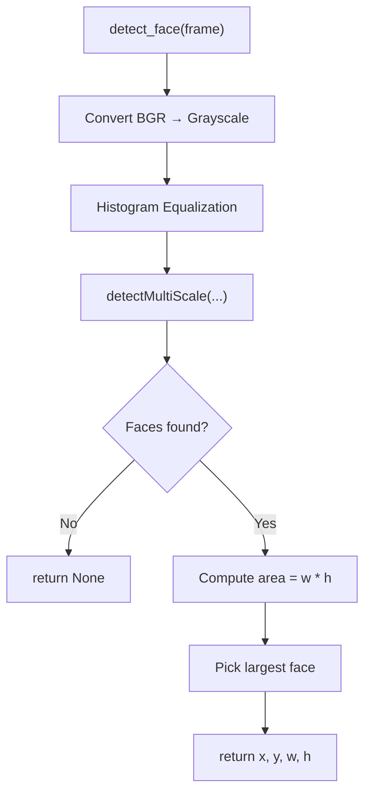
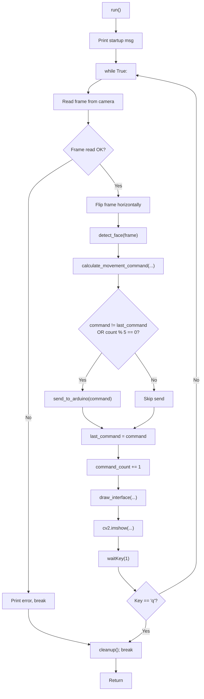
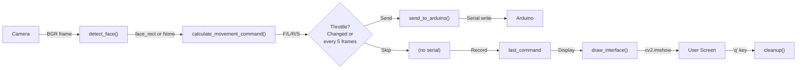
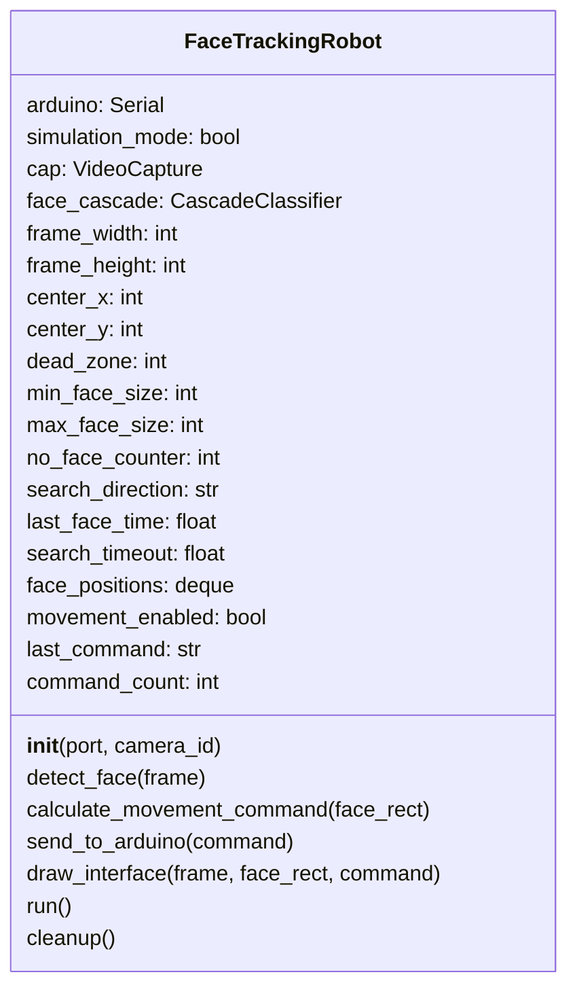

# ObjectDetection.py – Detailed Documentation

## Overview
`ObjectDetection.py` is the **PC-side brain** of the robot. It captures video from a webcam, detects faces using OpenCV's Haar Cascade, makes movement decisions, and sends commands over serial to the Arduino.

---

## Table of Contents
1. Module Docstring & Imports
2. Class: `FaceTrackingRobot`
3. Function Reference
4. Data Flow & State
5. Diagrams

---

## 1) Module Docstring & Imports

### What It Says
```
Face Tracking Robot Controller (PC-side)

This script detects a face in the camera feed, then sends ONE of these single-letter commands over serial:
- 'F' = face detected and centered enough -> move forward
- 'L' = face detected and offset left -> turn left
- 'R' = face detected and offset right -> turn right
- 'S' = face detected but too close -> stop

Special case:
- If NO face is detected, it sends 'R' continuously (search by rotating right).
```

### Imports
| Import | Purpose |
|---|---|
| `cv2` | OpenCV: camera capture, face detection, image drawing |
| `serial` | PySerial: serial port communication with Arduino |
| `time` | Timing delays and timestamp tracking |
| `deque` (from `collections`) | Fixed-length queue for smoothing face positions |
| `sys` | System exit (`sys.exit()`) |

---

## 2) Class: `FaceTrackingRobot`

The main class that encapsulates camera, face detector, and Arduino communication.

### Instance Variables (Initialized in `__init__`)

| Variable | Type | Purpose |
|---|---|---|
| `self.arduino` | `serial.Serial` or `None` | Serial port object; `None` if not connected |
| `self.simulation_mode` | `bool` | `True` if no Arduino or connection failed |
| `self.cap` | `cv2.VideoCapture` | Camera object |
| `self.face_cascade` | `cv2.CascadeClassifier` | Haar cascade detector |
| `self.frame_width` | `int` | Camera frame width (usually 640) |
| `self.frame_height` | `int` | Camera frame height (usually 480) |
| `self.center_x` | `int` | Horizontal center of frame (320) |
| `self.center_y` | `int` | Vertical center of frame (240) |
| `self.dead_zone` | `int` | **80** pixels; turning margin |
| `self.min_face_size` | `int` | **15000**; UI-only, not used for decisions |
| `self.max_face_size` | `int` | **60000**; "too close" threshold |
| `self.no_face_counter` | `int` | Counts consecutive frames with no face |
| `self.search_direction` | `str` | **Unused** (legacy field) |
| `self.last_face_time` | `float` | Timestamp of last face detection |
| `self.search_timeout` | `float` | **Unused** (2.0 seconds) |
| `self.face_positions` | `deque` | Stores last 5 face positions + areas (for smoothing) |
| `self.movement_enabled` | `bool` | **Always True** in this version |
| `self.last_command` | `str` or `None` | Previous command sent (for de-spamming) |
| `self.command_count` | `int` | Incremented each frame (for periodic resend) |

---

## 3) Function Reference

### `__init__(arduino_port=None, camera_id=0)`

**Purpose:** Initialize the robot controller.

**Parameters:**
- `arduino_port` (str or None): Serial port name (e.g., "COM3") or None for simulation
- `camera_id` (int): Camera index (0 for default webcam, 1 for external)

**Steps:**
1. Initialize Arduino serial connection (if port provided)
   - If fails, set `simulation_mode = True`
2. Open camera at requested resolution (640x480)
   - Exit program if camera not available
3. Load Haar cascade face detector
   - Exit program if cascade fails to load
4. Set all control parameters (dead zone, face size thresholds)
5. Print startup messages

**Raises:**
- `sys.exit(1)` if camera or cascade cannot be loaded

**Example:**
```python
robot = FaceTrackingRobot(arduino_port="COM3", camera_id=0)
# or simulation mode:
robot = FaceTrackingRobot(arduino_port=None, camera_id=0)
```

---

### `detect_face(frame)`

**Purpose:** Detect a face in the given video frame.

**Parameters:**
- `frame` (numpy.ndarray): BGR color image from camera

**Returns:**
- `(x, y, w, h)` tuple if a face is found (bounding box)
- `None` if no face is detected

**Algorithm:**
1. Convert frame to grayscale
2. Apply histogram equalization (improves contrast)
3. Run `detectMultiScale()`:
   - Scale factor: 1.1 (small = more accuracy, slower)
   - Min neighbors: 6 (higher = fewer false positives)
   - Min size: (80, 80) pixels
   - Max size: (400, 400) pixels
4. If faces found, return the **largest** one by area (closest face)
5. If no faces, return `None`

**Diagram – Face Detection Flow:**


---

### `calculate_movement_command(face_rect)`

**Purpose:** Decide which command to send based on face position/size.

**Parameters:**
- `face_rect` (tuple or None): Bounding box `(x, y, w, h)` or `None`

**Returns:**
- `'F'`: Move forward
- `'L'`: Turn left
- `'R'`: Turn right
- `'S'`: Stop

**Logic:**

```
IF no face detected:
  RETURN 'R'  (search by rotating right)

ELSE (face detected):
  Smooth position using deque (average of last 5 frames)
  Compute face_area = w * h
  Compute offset_x = face_center_x - frame_center_x

  IF area > max_face_size (60000):
    RETURN 'S'  (too close, stop)
  ELSE IF abs(offset_x) >= dead_zone (80):
    IF offset_x < 0:
      RETURN 'L'  (face on left, turn left)
    ELSE:
      RETURN 'R'  (face on right, turn right)
  ELSE:
    RETURN 'F'  (face centered and not too close, move forward)
```

**Side Effects:**
- Resets `no_face_counter` when face is detected
- Updates `last_face_time` timestamp
- Appends position to `face_positions` deque

**Important Note:**
- `min_face_size` (15000) is **not used** in the logic. If you want to stop when face is "too far", you must add a check.

**Diagram – Decision Tree:**
```mermaid
flowchart TD
  A["calculate_movement_command(face_rect)"] --> B{face_rect is None?}
  B -->|Yes| C["return 'R'<br/>Search by rotating"]
  B -->|No| D["Smooth position<br/>avg_area, offset_x"]
  D --> E{avg_area > 60000?}
  E -->|Yes| F["return 'S'<br/>Too close!"]
  E -->|No| G{abs(offset_x) >= 80?}
  G -->|Yes| H{offset_x < 0?}
  H -->|Yes| I["return 'L'<br/>Face left"]
  H -->|No| J["return 'R'<br/>Face right"]
  G -->|No| K["return 'F'<br/>Centered, move"]
  F --> L["Update counters"]
  I --> L
  J --> L
  K --> L
```

---

### `send_to_arduino(command)`

**Purpose:** Send a command over serial to the Arduino (or simulate it).

**Parameters:**
- `command` (str): Single character ('F', 'L', 'R', 'S', or other)

**Returns:**
- `True` if sent/simulated successfully
- `False` if failed or command not allowed

**Behavior:**

| Condition | Action |
|---|---|
| Command not in `{'F', 'L', 'R', 'S'}` | Return `False` (ignore) |
| `simulation_mode == True` | Print `[SIM] Command: FORWARD/LEFT/RIGHT/STOP` to console |
| `simulation_mode == False` + Arduino connected | Write bytes to serial port |
| Arduino write fails | Print error message, return `False` |

**Example:**
```python
robot.send_to_arduino('F')  # Sends b'F' to serial or prints [SIM] Command: FORWARD
```

---

### `draw_interface(frame, face_rect, command)`

**Purpose:** Draw UI overlays on the video frame.

**Parameters:**
- `frame` (numpy.ndarray): BGR image to draw on
- `face_rect` (tuple or None): Face bounding box
- `command` (str): Current command for display

**Returns:**
- Modified frame with overlays

**What It Draws:**

1. **Grid lines:** Vertical + horizontal lines through frame center (green)
2. **Dead zone box:** Rectangle around center (dark green)
3. **Face box:** Blue rectangle around detected face (if present)
4. **Face center dot:** Yellow circle at face center
5. **Face-to-center line:** Yellow line from frame center to face center
6. **Face area text:** Display pixel area above face
7. **Distance status:** "TOO FAR" (yellow) / "GOOD" (green) / "TOO CLOSE" (red)
8. **Status text:** "ACTIVE" or "PAUSED" (always ACTIVE in current version)
9. **Command text:** Current command name (FORWARD, LEFT, RIGHT, STOP)
10. **Mode text:** "SIMULATION" or "ROBOT CONTROL"
11. **No-face counter:** If no face, shows frame count

**Diagram – UI Layout:**
```
┌─────────────────────────────────┐
│  Status: ACTIVE                 │
│  Command: FORWARD               │
│  Mode: ROBOT CONTROL            │
│                                 │
│      ↑                          │
│      │                          │
│   ◄──●──►  (frame center)       │
│      │                          │
│      ↓                          │
│                                 │
│                  [Face Box]     │
│                      ◎          │
│                 (face center)   │
│                                 │
│  Distance: GOOD                 │
│  Area: 28000                    │
│                                 │
│  Press 'q': Quit               │
└─────────────────────────────────┘
```

---

### `run()`

**Purpose:** Main tracking loop (infinite until user quits).

**Steps:**
1. Print "Starting face tracking..."
2. Loop forever:
   a. Read one frame from camera
   b. Flip frame horizontally (mirror view)
   c. Detect face in frame
   d. Decide command based on face
   e. Send command (if changed or every 5 frames)
   f. Update `last_command` and `command_count`
   g. Draw UI overlays
   h. Display frame in window
   i. Wait for key (1ms)
   j. If 'q' pressed, break loop
3. Call `cleanup()`

**Timing:**
- No `delay()` or `sleep()` in the loop
- Only `cv2.waitKey(1)` (~1ms per frame)
- Frame rate depends on camera + processing (typically 20–30 FPS)

**Diagram – Main Loop:**


---

### `cleanup()`

**Purpose:** Safely shut down resources.

**Steps:**
1. Print "Cleaning up..."
2. If Arduino connected (not simulation):
   - Send a final `'S'` (stop command)
   - Wait 0.1 seconds
   - Close serial port
3. Release camera object
4. Close all OpenCV windows
5. Print "✓ Cleanup complete" and "Goodbye!"

**Example:**
```python
robot.cleanup()
# Prints:
# Cleaning up...
# ✓ Cleanup complete
# Goodbye!
```

---

### `find_arduino_port()` (Module-level function)

**Purpose:** Auto-detect Arduino serial port.

**Returns:**
- Port name (str): "COM1", "COM2", ..., "COM9" (first one that works)
- `None` if no port found

**Algorithm:**
1. Try opening each port COM1 through COM9 at 115200 baud
2. If successful, close it and return the port name
3. If none work, return `None`

**Use Case:**
```python
port = find_arduino_port()
if port:
    print(f"Found Arduino on {port}")
else:
    print("No Arduino found")
```

---

### `main()` (Module-level function)

**Purpose:** Script entry point; handle user input and create robot.

**Steps:**
1. Print header banner
2. Call `find_arduino_port()` to auto-detect
3. If found, ask user for confirmation
4. Ask for camera ID (default 0)
5. Create `FaceTrackingRobot` instance
6. Call `robot.run()`

**User Input Flow:**
```
Auto-detect Arduino? (y/n)
  → If 'y', use detected port
  → If not 'y', ask for manual port
  → If empty input, use simulation

Enter camera ID (0 for default, 1 for external): 
  → Try to parse as int
  → If invalid, default to 0
```

---

## 4) Data Flow & State

### Typical Data Path (One Frame)
```
Camera Frame (BGR)
    ↓
detect_face()
    ↓ (face_rect or None)
calculate_movement_command()
    ↓ (command: F/L/R/S)
send_to_arduino()
    ↓ (serial write or [SIM] print)
draw_interface()
    ↓ (frame with overlays)
cv2.imshow()
    ↓ (display to user)
```

### State Variables That Persist Across Frames
- `self.last_command` – Used to de-spam serial
- `self.command_count` – Used for periodic re-send every 5 frames
- `self.face_positions` – Deque of last 5 detections (smoothing)
- `self.no_face_counter` – Counts frames with no face
- `self.arduino`, `self.cap`, `self.face_cascade` – Resources

---

## 5) Diagrams

### Full System Data Flow


### Class Structure (Instance Variables & Methods)


### Command Decision Matrix
| Condition | Output |
|---|---|
| No face detected | `'R'` (search) |
| Face detected, area > 60000 | `'S'` (stop) |
| Face left (offset_x < -80) | `'L'` (turn left) |
| Face right (offset_x > 80) | `'R'` (turn right) |
| Face centered, area ≤ 60000 | `'F'` (forward) |

---

## 6) Example Session

```python
$ python ObjectDetection.py

============================================================
FACE TRACKING ROBOT
Sends only: F / L / R / S
No face: sends 'R' (search right)
============================================================
Auto-detected Arduino on: COM3
Use this port? (y/n): y
Enter camera ID (0 for default, 1 for external): 0

✓ Connected to Arduino on COM3
✓ Face detection model loaded

==================================================
FACE TRACKING ROBOT CONTROLS
==================================================
Commands sent: F / L / R / S only
When NO FACE detected: sends 'R' (search right)
Press 'q' to quit
==================================================

Starting face tracking...
[SIM] Command: FORWARD
[SIM] Command: LEFT
[SIM] Command: FORWARD
...
(window shows live camera feed with overlays)

Shutting down...

Cleaning up...
✓ Cleanup complete
Goodbye!
```

---

## Summary
- **Main Goal:** Detect faces and send movement commands over serial
- **Key Decision Logic:** No face → `R`, Too close → `S`, Off-center → `L`/`R`, Centered → `F`
- **Key Limitation:** `min_face_size` doesn't affect decisions (UI-only)
- **Non-blocking:** Uses frame skipping instead of `delay()`
