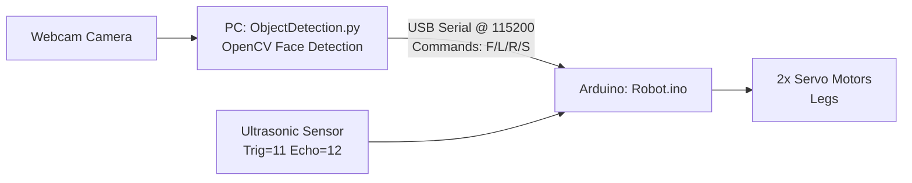

# Robot Repository Report (Detailed)

## 1) What This Repo Is
This repository implements a simple **PC + Arduino robot** system:

- The **PC** runs **Python + OpenCV** to detect a face from a webcam.
- The PC sends **single-letter commands** over **USB Serial** to an **Arduino**.
- The **Arduino** translates those commands into **servo movements** (two legs) and also performs **obstacle detection** using an **ultrasonic sensor**.

The command protocol is intentionally tiny:
- `F` = move forward
- `L` = rotate left
- `R` = rotate right
- `S` = stop


## 2) Files and Responsibilities

| File | Language | Role |
|---|---|---|
| `ObjectDetection.py` | Python | Webcam capture + face detection + send `F/L/R/S` over serial |
| `Robot.ino` | Arduino/C++ | Main sketch: reads serial commands + obstacle stop + executes movement |
| `Robot.cpp` | Arduino/C++ | Movement implementation: non-blocking step/rotate state machines + ultrasonic |
| `Robot.h` | Arduino/C++ | Pin/angle macros + function prototypes + state enums |
| `README.md` | Markdown | Currently empty |


## 3) System Architecture (Diagram)




## 4) Serial Command Protocol

### 4.1 What The PC Sends
From `ObjectDetection.py` the PC sends exactly one of:

- `F`, `L`, `R`, `S`

The Python code also reduces spamming by sending only:
- when the command changes, **or**
- every 5 frames (a periodic “refresh”).

### 4.2 What The Arduino Accepts
In `Robot.ino`, the Arduino accepts a command only if:
- it is one of `F/L/R/S`, and
- it is different from the current command

Then the Arduino stores it as `current_cmd`.


## 5) Python Side Details (`ObjectDetection.py`)

### 5.1 Core Loop Summary
The Python script:
1. Opens the camera at (requested) `640x480`.
2. Loads OpenCV Haar cascade face detector.
3. Each frame:
   - detects a face rectangle
   - decides a command (`F/L/R/S`)
   - sends it to Arduino (with throttling)
   - draws UI overlays

### 5.2 Face Detection Method
- Uses Haar cascade: `haarcascade_frontalface_default.xml`
- Converts image to grayscale and applies histogram equalization.
- Picks the **largest** detected face (most prominent / closest).

### 5.3 Command Decision Logic (Important)
The code’s behavior right now is:

- **If no face is detected:** send `R` (rotate right) continuously (search).
- **If face is detected and too close:** send `S`.
- **If face is detected and off-center horizontally:** send `L` or `R` to re-center.
- **Else:** send `F`.

Key tuning parameters (current values):
- `dead_zone = 80` pixels
- `max_face_size = 60000` (area threshold used for “too close”)
- `min_face_size = 15000` exists but is **UI-only** (shows “TOO FAR”), it does **not** change the command decision.

### 5.4 Python Flowchart (Diagram)

```mermaid
flowchart TD
  A[Start] --> B[Open Camera]
  B --> C[Load Haar Cascade]
  C --> D[Loop: Read Frame]
  D --> E[Detect Face]
  E -->|No face| F[Command = 'R']
  E -->|Face found| G[Compute face center + area\nSmooth using deque]
  G --> H{Area > max_face_size?}
  H -->|Yes| I[Command = 'S']
  H -->|No| J{abs(offset_x) >= dead_zone?}
  J -->|Yes| K[Command = 'L' if left\nelse 'R']
  J -->|No| L[Command = 'F']
  F --> M[Send if changed\nor every 5 frames]
  I --> M
  K --> M
  L --> M
  M --> N[Draw UI + waitKey]
  N -->|q| O[Cleanup + Exit]
  N -->|else| D
```


## 6) Arduino Side Details (`Robot.ino`, `Robot.cpp`, `Robot.h`)

### 6.1 Startup (`setup()`)
- Attaches right leg servo to pin 9 and left leg servo to pin 10
- Sets ultrasonic pins: Echo=12, Trig=11
- Calls `robot_stop()`
- Starts serial at `115200`

### 6.2 Main Loop (`loop()`)
Each `loop()` does:

1) **Read Serial command** (if available)
- Reads one byte
- If it is a valid command (`F/L/R/S`) and different from `current_cmd`:
  - If robot is moving (`stopped == false`), call `robot_stop()` first
  - Set `current_cmd = cmd`

2) **Obstacle detection**
- Calls `read_distance()`
- If `distance > 0 && distance <= 15` (cm), it forces: `current_cmd = 'S'`

3) **Execute one step**
- `F`: calls `move(500, 250)`
- `L`: calls `rotate(RIGHT_LEG, 500, 250)`
- `R`: calls `rotate(LEFT_LEG, 500, 250)`
- `S`: calls `robot_stop()` if not already stopped

### 6.3 Arduino Flowchart (Diagram)

```mermaid
flowchart TD
  A[loop()] --> B{Serial.available() > 0?}
  B -->|Yes| C[Read byte -> cmd]
  C --> D{cmd != current_cmd\nAND cmd in F/L/R/S?}
  D -->|Yes| E{stopped == false?}
  E -->|Yes| F[robot_stop(); stopped=true]
  E -->|No| G[No action]
  F --> H[current_cmd = cmd]
  G --> H
  D -->|No| I[Ignore cmd]
  B -->|No| J[Skip serial]

  H --> K[distance = read_distance()]
  I --> K
  J --> K

  K --> L{0 < distance <= 15?}
  L -->|Yes| M[current_cmd = 'S']
  L -->|No| N[Keep current_cmd]

  M --> P{switch(current_cmd)}
  N --> P

  P -->|F| Q[move(500,250)\nstopped=false]
  P -->|L| R[rotate(RIGHT_LEG,500,250)\nstopped=false]
  P -->|R| S[rotate(LEFT_LEG,500,250)\nstopped=false]
  P -->|S| T[robot_stop() if needed\nstopped=true]
  P -->|default| U[robot_stop() if needed\nstopped=true]

  Q --> A
  R --> A
  S --> A
  T --> A
  U --> A
```

### 6.4 Non-Blocking Motion (Why `move()`/`rotate()` look “weird”)
In `Robot.cpp`, both `move(...)` and `rotate(...)` are **non-blocking state machines**:

- They use `static` variables to remember their state between calls.
- They use `millis()` timing checks instead of `delay()`.
- Each time you call them from `loop()`, they may:
  - return immediately (if not enough time passed), or
  - advance exactly one state (e.g., move leg, then stop leg).

This is good for robotics because it keeps `loop()` responsive (so it can still read serial and check obstacles).


## 7) Practical Notes / Tuning

### 7.1 Python Tuning
- `dead_zone`: larger = less turning jitter, but slower to align.
- `max_face_size`: lower = stops earlier (more sensitive to “close”).

If you want the robot to behave differently when the face is “too far”, you would add a rule using `min_face_size` in `calculate_movement_command`.

### 7.2 Arduino Timing
- `move(500, 250)` and `rotate(..., 500, 250)` control how long to move a servo (motion time) and how long to pause between steps.
- Bigger values = slower movement but may be more stable.


## 8) Known Quirks (Not necessarily bugs)

### 8.1 Python
- `min_face_size` is used only for UI text (“TOO FAR”), not for decisions.
- `search_direction`, `search_timeout`, `last_face_time` are currently bookkeeping that don’t change behavior.
- The “no face” search is always rotate right (`R`).

### 8.2 Arduino
- Obstacle detection overrides any command and forces `S` when within 15 cm.


## 9) How To Run

### 9.1 Arduino
- Open `Robot.ino` in Arduino IDE
- Select the correct board + COM port
- Upload

### 9.2 Python
Install dependencies:
- `pip install opencv-python pyserial`

Run:
- `python ObjectDetection.py`

It will attempt to auto-detect `COM1..COM9` at 115200.


---
If you want the report to include **real screenshots** (camera window, wiring photo, etc.), you can upload images and I’ll embed them into this report.
