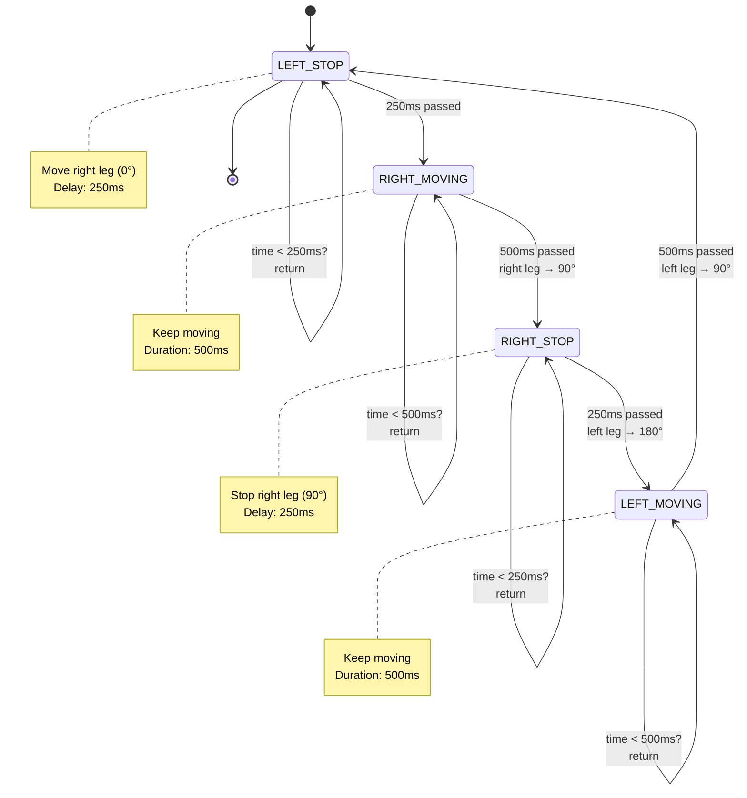
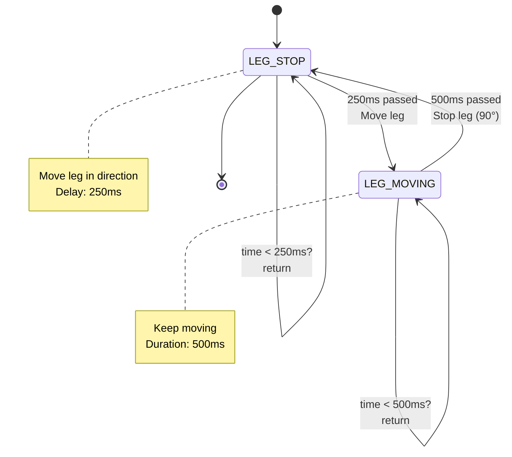

# Robot.cpp – Detailed Documentation

## Overview
`Robot.cpp` contains the implementation of the robot's **physical movement functions**. It includes:
1. Setup functions for servos and sensors
2. Obstacle detection via ultrasonic sensor
3. Non-blocking movement state machines (`move()`, `rotate()`)
4. Utility functions

This file is compiled with `Robot.h` and included in `Robot.ino`.

---

## Table of Contents
1. Global Variables & Pin Definitions
2. Setup Functions
3. Sensor Function (`read_distance()`)
4. Movement Execution Functions
5. State Machines Explained
6. Non-blocking Timing
7. Diagrams

---

## 1) Global Variables & Pin Definitions

### Servo Objects
```cpp
Servo leg1;     // Right leg servo (pin 9)
Servo leg2;     // Left leg servo (pin 10)
```

### Ultrasonic Sensor Pins
```cpp
int echo = 0;   // Echo input pin (12)
int trig = 0;   // Trigger output pin (11)
```

These are set by `ultrsnc_head_setup()` and used by `read_distance()`.

---

## 2) Setup Functions

### `R_leg_setup(int pin)`

**Purpose:** Initialize the right leg servo.

**Parameters:**
- `pin` (int): GPIO pin number (typically 9)

**Implementation:**
```cpp
void R_leg_setup(int pin)
{
    leg1.attach(pin);
}
```

**Effect:**
- Attaches the `leg1` servo object to the specified pin
- Servo starts at default position (0°)

**Called from:** `Robot.ino` → `setup()`

---

### `L_leg_setup(int pin)`

**Purpose:** Initialize the left leg servo.

**Parameters:**
- `pin` (int): GPIO pin number (typically 10)

**Implementation:**
```cpp
void L_leg_setup(int pin)
{
    leg2.attach(pin);
}
```

**Effect:**
- Attaches the `leg2` servo object to the specified pin
- Servo starts at default position (0°)

**Called from:** `Robot.ino` → `setup()`

---

### `ultrsnc_head_setup(int echo1, int trig1)`

**Purpose:** Initialize the ultrasonic sensor.

**Parameters:**
- `echo1` (int): GPIO pin for echo (signal return, typically 12)
- `trig1` (int): GPIO pin for trigger (pulse send, typically 11)

**Implementation:**
```cpp
void ultrsnc_head_setup(int echo1, int trig1)
{
    echo = echo1;
    trig = trig1;
    pinMode(echo, INPUT);      // Echo pin is input
    pinMode(trig, OUTPUT);     // Trigger pin is output
}
```

**Effect:**
- Stores pin numbers in global variables
- Sets `echo` as INPUT (receive signal)
- Sets `trig` as OUTPUT (send trigger pulse)

**Called from:** `Robot.ino` → `setup()`

---

## 3) Sensor Function: `read_distance()`

**Purpose:** Measure obstacle distance using the ultrasonic sensor.

**Returns:**
- Distance in centimeters (float), or
- `-1` if no obstacle detected within range

**Algorithm (HC-SR04 protocol):**

1. **Ensure trigger pin is LOW**
   ```cpp
   digitalWrite(trig, LOW);
   delayMicroseconds(2);
   ```

2. **Send 10 µs pulse on trigger pin**
   ```cpp
   digitalWrite(trig, HIGH);
   delayMicroseconds(10);
   digitalWrite(trig, LOW);
   ```

3. **Measure echo pulse duration**
   ```cpp
   duration = pulseIn(echo, HIGH, 2332UL);
   ```
   - Waits for echo pin to go HIGH
   - Measures time until it goes LOW
   - Timeout: 2332 µs (prevents hanging)
   - Max detectable distance: ~40 cm

4. **Convert duration to distance**
   ```cpp
   if (duration == 0)
       return -1;  // Timeout, no obstacle
   
   distance = (duration * 0.0343) / 2.0;  // cm
   return distance;
   ```
   - Speed of sound: 343 m/s = 0.0343 cm/µs
   - Divide by 2 because sound travels to obstacle and back

**Timing:**
- Best case: ~2 µs (pulse sent)
- Worst case: ~2340 µs (full timeout)
- Typical: 500–2000 µs depending on distance

**Diagram – Ultrasonic Measurement:**


---

## 4) Movement Execution Functions

### `leg_act(int leg, int servo_action)`

**Purpose:** Send a command to a specific leg servo.

**Parameters:**
- `leg` (int): `RIGHT_LEG` (1) or `LEFT_LEG` (2)
- `servo_action` (int): Servo angle (0–180)
  - `MOVE_R = 0` (right leg forward)
  - `MOVE_L = 180` (left leg forward)
  - `STOP = 90` (neutral)

**Implementation:**
```cpp
void leg_act(int leg, int servo_action)
{
    if (leg == RIGHT_LEG)
        leg1.write(servo_action);
    else if (leg == LEFT_LEG)
        leg2.write(servo_action);
}
```

**Effect:**
- Writes the angle to the servo
- Servo immediately moves to that angle

**Example:**
```cpp
leg_act(RIGHT_LEG, MOVE_R);    // Right leg forward (0°)
leg_act(LEFT_LEG, STOP);       // Left leg neutral (90°)
```

---

### `robot_stop()`

**Purpose:** Stop both legs (bring them to neutral position).

**Implementation:**
```cpp
void robot_stop()
{
    leg_act(RIGHT_LEG, STOP);   // Right leg to 90°
    leg_act(LEFT_LEG, STOP);    // Left leg to 90°
}
```

**Effect:**
- Both servos immediately move to 90° (neutral)
- Robot becomes stationary

**Called from:**
- `Robot.ino` → `setup()`
- `Robot.ino` → `loop()` when transitioning commands

---

## 5) Movement Functions: State Machines

Both `move()` and `rotate()` are **non-blocking state machines**. They use `static` variables to remember their state between calls and `millis()` timing to control delays.

### `move(unsigned int t_motion_delayms, unsigned int t_stop_delayms)`

**Purpose:** Move the robot forward by alternating leg steps (one step per call).

**Parameters:**
- `t_motion_delayms` (int): Duration servo is in motion (ms), typically 500
- `t_stop_delayms` (int): Duration between steps (pause), typically 250

**Returns:** `void` (advances state on each call)

**State Machine (4 states):**

| State | Action | Next State |
|---|---|---|
| `LEFT_STOP` (initial) | Move right leg forward (0°) | `RIGHT_MOVING` |
| `RIGHT_MOVING` | Stop right leg (90°) | `RIGHT_STOP` |
| `RIGHT_STOP` | Move left leg forward (180°) | `LEFT_MOVING` |
| `LEFT_MOVING` | Stop left leg (90°) | `LEFT_STOP` (cycle repeats) |

**Non-blocking Timing:**
```cpp
static unsigned long last_time = 0;
unsigned long now = millis();

if (state == LEFT_STOP || state == RIGHT_STOP) {
    if (now - last_time < t_stop_delayms)
        return;  // Wait for pause to complete
} else {
    if (now - last_time < t_motion_delayms)
        return;  // Wait for motion to complete
}

last_time = now;  // Reset timer
// ... execute next state ...
```

**Diagram – Forward Walk State Machine:**


**Timing Diagram (500ms motion, 250ms stop):**
```
Time:     0ms     250ms          750ms          1250ms         1500ms
          |       |              |              |              |
Right:    →→→→→→  STOP  ←←←←←←  (stop)         →→→→→→  (move)
          [move]  [pause]        [pause]        [move]
          500ms    250ms          500ms          250ms

Left:            [pause]        ↑↑↑↑↑↑  STOP  [pause]       ↑↑↑↑↑↑
                  250ms          [move]  500ms             [move]
                                 500ms

Complete step
(both legs):      ←──── 1250 ms ────→

Robot moves
forward per
iteration!
```

**Example Usage:**
```cpp
// In Robot.ino loop()
move(500, 250);  // Call this every iteration while 'F' command is active
// First call:   RIGHT_MOVING → LEFT_STOP
// Second call:  (waits for timing)
// Third call:   RIGHT_STOP → (right leg stops)
// ...continues until command changes
```

---

### `rotate(int leg, unsigned int t_motion_delayms, unsigned int t_stop_delayms)`

**Purpose:** Rotate the robot by moving one leg (one step per call).

**Parameters:**
- `leg` (int): `RIGHT_LEG` or `LEFT_LEG` (which leg to move)
- `t_motion_delayms` (int): Motion duration (ms), typically 500
- `t_stop_delayms` (int): Pause duration (ms), typically 250

**Returns:** `void` (advances state on each call)

**State Machine (2 states):**

| State | Action | Next State |
|---|---|---|
| `LEG_STOP` | Move the specified leg | `LEG_MOVING` |
| `LEG_MOVING` | Stop the leg (90°) | `LEG_STOP` (cycle repeats) |

**How rotation works:**
- If `leg == RIGHT_LEG`: moves right leg, left leg stays at 90° → rotates left
- If `leg == LEFT_LEG`: moves left leg, right leg stays at 90° → rotates right

**State Diagram:**


**Rotation Timing (500ms motion, 250ms stop):**
```
Rotate LEFT (using RIGHT_LEG):

Time:     0ms     250ms          750ms
          |       |              |
Right:    →→→→→→  STOP           (repeats)
          [move]  [pause]
          500ms    250ms

Left:     STOP    STOP     STOP
          (fixed at 90°)

Result: Robot rotates left in 750ms per step
```

**Example Usage:**
```cpp
// In Robot.ino loop()
rotate(LEFT_LEG, 500, 250);   // Rotate right
// or
rotate(RIGHT_LEG, 500, 250);  // Rotate left
```

---

## 6) Non-blocking Timing Explained

### Why Not Use `delay()`?

```cpp
// BAD: Blocks everything
while (movement_needed) {
    servo.write(angle);
    delay(500);  // ❌ Arduino can't read serial or check obstacles!
}

// GOOD: Non-blocking
move(500, 250);  // ✓ Reads serial and checks obstacles every iteration
```

### How It Works

The functions use `static` variables and elapsed time checks:

```cpp
static unsigned long last_time = 0;
unsigned long now = millis();

if (now - last_time < required_delay) {
    return;  // Early exit, don't advance state yet
}

last_time = now;  // Update timer
// ... advance state ...
```

**Benefit:**
- `loop()` continues to run every ~2.5 ms
- Serial commands are read continuously
- Obstacles are detected in real-time
- Responsive, safe robot behavior

---

## 7) Diagrams

### Servo Angle Reference
```
LEFT_LEG (leg2):
  180° ←─→ forward (move left)
   90° ←─→ neutral (stop)
    0° ←─→ backward

RIGHT_LEG (leg1):
    0° ←─→ forward (move right)
   90° ←─→ neutral (stop)
  180° ←─→ backward
```

### Full Movement Flow


### Hardware Wiring Reference
```
Arduino Board
├─ Pin 9  ──→ RIGHT_LEG servo (Leg 1)
├─ Pin 10 ──→ LEFT_LEG servo (Leg 2)
├─ Pin 11 ──→ Ultrasonic TRIG
├─ Pin 12 ──→ Ultrasonic ECHO
├─ 5V     ──→ Servo power (or external)
└─ GND    ──→ Common ground

Ultrasonic Sensor (HC-SR04)
├─ TRIG ──→ Pin 11
├─ ECHO ──→ Pin 12
├─ 5V   ──→ 5V
└─ GND  ──→ GND

Servo Legs
├─ Servo 1 (Right) ──→ Pin 9
├─ Servo 2 (Left)  ──→ Pin 10
└─ Both: GND to common, 5V to power (external recommended)
```

---

## Summary

- **Purpose:** Implement physical movement via non-blocking state machines
- **Key Concept:** Use `millis()` timing instead of `delay()` to keep loop responsive
- **Forward Walk:** Alternates right and left leg (4-state machine)
- **Rotation:** Moves one leg while other is locked (2-state machine)
- **Safety:** Obstacle detection can interrupt any movement
- **Flexibility:** Timing parameters (`t_motion_delayms`, `t_stop_delayms`) allow tuning speed

