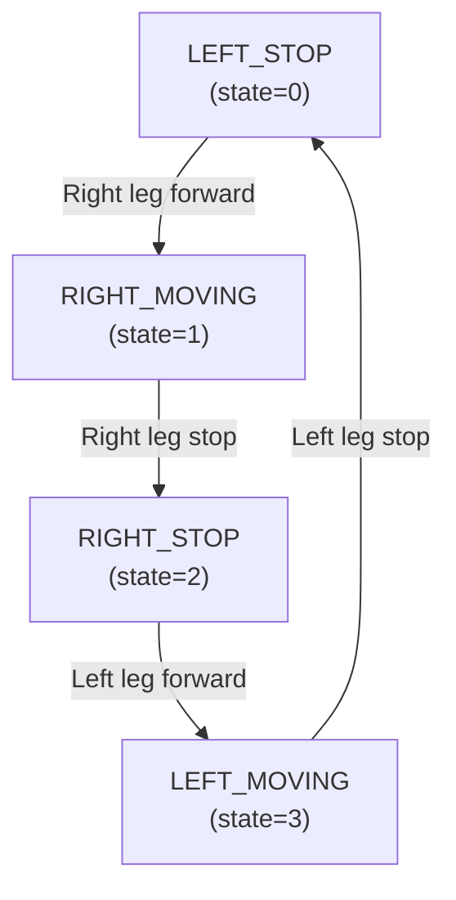
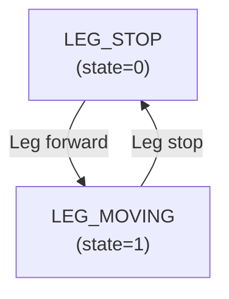

# Robot.h – Detailed Documentation

## Overview
`Robot.h` is the **header file** that defines:
1. Pin macro constants
2. Servo angle macros
3. State machine enums
4. Function prototypes (declarations)

It is included in both `Robot.ino` and `Robot.cpp`.

---

## Table of Contents
1. Include Guards
2. Pin & Angle Macros
3. State Enums
4. Function Prototypes
5. Reference Summary

---

## 1) Include Guards

```cpp
#ifndef ROBOT_H
#define ROBOT_H
// ... file contents ...
#endif
```

**Purpose:**
- Prevents multiple inclusion of the same header
- Avoids duplicate declarations and linker errors

**How it works:**
- First include: `ROBOT_H` is not defined, so file is included and `#define ROBOT_H` is set
- Second include: `ROBOT_H` is already defined, so the guard prevents re-inclusion

---

## 2) Pin & Angle Macros

Macros are **compile-time constants** that make the code more readable and easier to maintain.

### Leg Identification
```cpp
#define RIGHT_LEG 1
#define LEFT_LEG  2
```

**Usage:**
```cpp
leg_act(RIGHT_LEG, MOVE_R);  // Instead of: leg_act(1, 0);
leg_act(LEFT_LEG, STOP);     // Instead of: leg_act(2, 90);
```

**Why macros:**
- `RIGHT_LEG` is clearer than `1`
- If numbering changes, only change one line
- Compiler replaces macros before compilation (zero runtime overhead)

---

### Servo Movement Angles
```cpp
#define MOVE_R 0     // Right leg moves forward
#define MOVE_L 180   // Left leg moves forward
#define STOP   90    // Both legs stop (neutral)
```

**Servo angle mapping:**

| Angle | Meaning (Right Leg) | Meaning (Left Leg) |
|---|---|---|
| **0°** | Forward/extend | Backward/retract |
| **90°** | Neutral/stop | Neutral/stop |
| **180°** | Backward/retract | Forward/extend |

**Why this arrangement:**
- Right leg: 0° = forward movement (natural direction)
- Left leg: 180° = forward movement (opposite servo orientation)
- Both: 90° = stop (neutral middle)

**Example:**
```cpp
// Move forward step
leg_act(RIGHT_LEG, MOVE_R);  // Right leg at 0° (forward)
leg_act(LEFT_LEG, MOVE_L);   // Left leg at 180° (forward)

// Stop
leg_act(RIGHT_LEG, STOP);    // Both to 90°
leg_act(LEFT_LEG, STOP);
```

---

## 3) State Enums

Enums provide **named constants** for state machine states, improving code clarity.

### Walking State Enum (`WalkState`)

```cpp
enum WalkState {
  LEFT_STOP = 0,
  RIGHT_MOVING,
  RIGHT_STOP,
  LEFT_MOVING
};
```

**Used in:** `Robot.cpp` → `move()` function

**Purpose:** Track the current step in the forward walking sequence

**State Progression:**
```
LEFT_STOP (0)
    ↓ (right leg starts moving)
RIGHT_MOVING (1)
    ↓ (right leg reaches end)
RIGHT_STOP (2)
    ↓ (right leg stops, left leg starts)
LEFT_MOVING (3)
    ↓ (left leg reaches end)
LEFT_STOP (0) ← Cycle repeats
```

**Diagram:**


**Code in `move()`:**
```cpp
static WalkState state = LEFT_STOP;

switch (state) {
    case LEFT_STOP:
        leg_act(RIGHT_LEG, MOVE_R);
        state = RIGHT_MOVING;
        break;
    case RIGHT_MOVING:
        leg_act(RIGHT_LEG, STOP);
        state = RIGHT_STOP;
        break;
    case RIGHT_STOP:
        leg_act(LEFT_LEG, MOVE_L);
        state = LEFT_MOVING;
        break;
    case LEFT_MOVING:
        leg_act(LEFT_LEG, STOP);
        state = LEFT_STOP;
        break;
}
```

---

### Rotation State Enum (`RotateState`)

```cpp
enum RotateState {
  LEG_STOP = 0,
  LEG_MOVING
};
```

**Used in:** `Robot.cpp` → `rotate()` function

**Purpose:** Track whether a leg is currently moving or paused during rotation

**State Progression:**
```
LEG_STOP (0)
    ↓ (leg starts moving)
LEG_MOVING (1)
    ↓ (leg reaches target angle)
LEG_STOP (0) ← Cycle repeats
```

**Diagram:**


**Code in `rotate()`:**
```cpp
static RotateState state = LEG_STOP;

switch (state) {
    case LEG_STOP:
        leg_act(leg, (leg == RIGHT_LEG) ? MOVE_R : MOVE_L);
        state = LEG_MOVING;
        break;
    case LEG_MOVING:
        leg_act(leg, STOP);
        state = LEG_STOP;
        break;
}
```

---

## 4) Function Prototypes

Function prototypes declare the **signature** (name, parameters, return type) of functions that are implemented elsewhere (`Robot.cpp`).

The compiler uses prototypes to:
- Verify function calls are correct
- Generate code to call functions
- Enable functions to call each other

---

### Setup Functions

#### `void R_leg_setup(int pin)`
- **Purpose:** Initialize right leg servo
- **Parameter:** GPIO pin number (typically 9)
- **Defined in:** `Robot.cpp`
- **Called from:** `Robot.ino` → `setup()`

#### `void L_leg_setup(int pin)`
- **Purpose:** Initialize left leg servo
- **Parameter:** GPIO pin number (typically 10)
- **Defined in:** `Robot.cpp`
- **Called from:** `Robot.ino` → `setup()`

#### `void ultrsnc_head_setup(int echo1, int trig1)`
- **Purpose:** Initialize ultrasonic sensor
- **Parameters:**
  - `echo1`: Echo pin (typically 12, input)
  - `trig1`: Trigger pin (typically 11, output)
- **Defined in:** `Robot.cpp`
- **Called from:** `Robot.ino` → `setup()`

---

### Operation Functions

#### `void robot_stop()`
- **Purpose:** Stop both legs (bring to neutral angle 90°)
- **Parameters:** None
- **Return:** `void`
- **Defined in:** `Robot.cpp`
- **Called from:** `Robot.ino` → `loop()`

#### `float read_distance()`
- **Purpose:** Measure obstacle distance using ultrasonic sensor
- **Parameters:** None
- **Return:** Distance in cm (float), or -1 if no obstacle detected
- **Range:** ~0–40 cm (practical)
- **Time:** ~2340 µs worst case
- **Defined in:** `Robot.cpp`
- **Called from:** `Robot.ino` → `loop()`

#### `void leg_act(int leg, int servo_action)`
- **Purpose:** Send servo command to a specific leg
- **Parameters:**
  - `leg`: `RIGHT_LEG` (1) or `LEFT_LEG` (2)
  - `servo_action`: Angle (0–180, typically 0, 90, or 180)
- **Return:** `void`
- **Defined in:** `Robot.cpp`
- **Called from:** `Robot.cpp` → `move()`, `rotate()`, `robot_stop()`

#### `void move(unsigned int t_motion_delayms, unsigned int t_stop_delayms)`
- **Purpose:** Move robot forward (non-blocking state machine)
- **Parameters:**
  - `t_motion_delayms`: Duration servo is in motion (ms)
  - `t_stop_delayms`: Duration between steps/pause (ms)
- **Return:** `void` (advances state on each call)
- **Typical:** `move(500, 250)` → 500ms move, 250ms pause
- **Defined in:** `Robot.cpp`
- **Called from:** `Robot.ino` → `loop()` (called repeatedly while 'F' command active)

#### `void rotate(int leg, unsigned int t_motion_delayms, unsigned int t_stop_delayms)`
- **Purpose:** Rotate robot using one leg (non-blocking state machine)
- **Parameters:**
  - `leg`: `RIGHT_LEG` (rotate left) or `LEFT_LEG` (rotate right)
  - `t_motion_delayms`: Motion duration (ms)
  - `t_stop_delayms`: Pause duration (ms)
- **Return:** `void` (advances state on each call)
- **Typical:** `rotate(LEFT_LEG, 500, 250)` → rotates right
- **Defined in:** `Robot.cpp`
- **Called from:** `Robot.ino` → `loop()` (called repeatedly while 'L' or 'R' command active)

---

## 5) Reference Summary

### Quick Lookup Tables

#### Macros
| Macro | Value | Purpose |
|---|---|---|
| `RIGHT_LEG` | 1 | Identify right leg in function calls |
| `LEFT_LEG` | 2 | Identify left leg in function calls |
| `MOVE_R` | 0 | Right leg forward angle |
| `MOVE_L` | 180 | Left leg forward angle |
| `STOP` | 90 | Neutral angle (both legs) |

#### State Enums
| Enum | Values | Purpose |
|---|---|---|
| `WalkState` | LEFT_STOP, RIGHT_MOVING, RIGHT_STOP, LEFT_MOVING | Track forward walking steps (4 states) |
| `RotateState` | LEG_STOP, LEG_MOVING | Track rotation steps (2 states) |

#### Functions
| Function | Purpose | Called From |
|---|---|---|
| `R_leg_setup(pin)` | Initialize right servo | setup() |
| `L_leg_setup(pin)` | Initialize left servo | setup() |
| `ultrsnc_head_setup(echo, trig)` | Initialize ultrasonic | setup() |
| `robot_stop()` | Stop both legs | loop(), move(), rotate() |
| `read_distance()` | Measure obstacle | loop() |
| `leg_act(leg, angle)` | Move servo | move(), rotate() |
| `move(motion_ms, pause_ms)` | Forward walk (FSM) | loop() |
| `rotate(leg, motion_ms, pause_ms)` | Rotate (FSM) | loop() |

---

### Pin Configuration
| Pin | Purpose | Mode | Arduino Pin | Notes |
|---|---|---|---|---|
| 9 | Right leg servo (PWM) | OUTPUT | D9 | 500–2400 µs pulse width |
| 10 | Left leg servo (PWM) | OUTPUT | D10 | 500–2400 µs pulse width |
| 11 | Ultrasonic TRIG | OUTPUT | D11 | Digital, LOW/HIGH |
| 12 | Ultrasonic ECHO | INPUT | D12 | Digital, measures pulse width |

---

### Servo Command Reference
```
RIGHT_LEG (leg1):
  leg_act(RIGHT_LEG, 0)    → Forward (MOVE_R)
  leg_act(RIGHT_LEG, 90)   → Stop (STOP)
  leg_act(RIGHT_LEG, 180)  → Backward

LEFT_LEG (leg2):
  leg_act(LEFT_LEG, 0)     → Backward
  leg_act(LEFT_LEG, 90)    → Stop (STOP)
  leg_act(LEFT_LEG, 180)   → Forward (MOVE_L)
```

---

## Summary

- **Purpose:** Define constants and function signatures for robot hardware control
- **Key Macros:** `RIGHT_LEG`/`LEFT_LEG`, `MOVE_R`/`MOVE_L`/`STOP`
- **Key Enums:** `WalkState` (4 states), `RotateState` (2 states)
- **Function Prototypes:** Setup, movement, and utility functions
- **No Implementation:** This file only declares; implementations are in `Robot.cpp`

