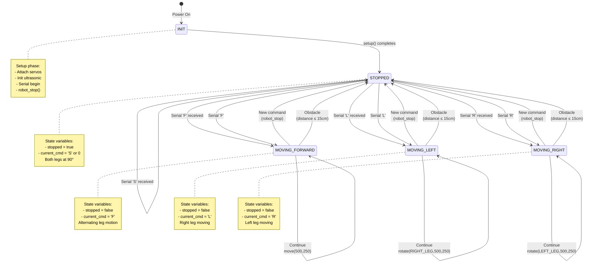

# Robot.ino – Detailed Documentation

## Overview
`Robot.ino` is the **main Arduino sketch**. It runs on the Arduino board and is responsible for:
1. Reading serial commands from the PC
2. Managing robot movement state
3. Obstacle detection via ultrasonic sensor
4. Executing movement commands (forward, rotate left/right, stop)

---

## Table of Contents
1. Global Variables
2. Function Reference (`setup()`, `loop()`)
3. Control Flow & State Machine
4. Diagrams
5. Example Runtime Trace

---

## 1) Global Variables

| Variable | Type | Purpose | Initial Value |
|---|---|---|---|
| `current_cmd` | `char` | Holds the command being executed | `0` (null) |
| `stopped` | `bool` | Tracks if robot is stationary | `false` |

### Notes
- `current_cmd` is the "active" command; it persists until a new valid command arrives or obstacle forces stop.
- `stopped` tracks motion state (helps coordinate smooth transitions between commands).

---

## 2) Function Reference

### `setup()`

**Purpose:** Initialize all hardware and prepare the Arduino for operation.

**Called:** Once at startup.

**Steps:**

1. **Initialize right leg servo (pin 9)**
   ```
   R_leg_setup(9);
   ```
   Calls function from `Robot.cpp` to attach servo.

2. **Initialize left leg servo (pin 10)**
   ```
   L_leg_setup(10);
   ```

3. **Initialize ultrasonic sensor (pins 11, 12)**
   ```
   ultrsnc_head_setup(12, 11);
   // Echo pin: 12 (input)
   // Trigger pin: 11 (output)
   ```

4. **Stop robot (safety)**
   ```
   robot_stop();
   stopped = true;
   ```
   Ensures legs are neutral at startup.

5. **Start serial communication at 115200 baud**
   ```
   Serial.begin(115200);
   ```
   Matches the PC baud rate.

**Diagram:**


---

### `loop()`

**Purpose:** Main execution loop that runs repeatedly until power off.

**Called:** Continuously after `setup()`.

**High-level flow:**
```
while (true) {
  1. Read serial command (if available)
  2. Detect obstacles with ultrasonic
  3. Execute current command (one step)
}
```

---

#### Part 1: Read Serial Command

**Code:**
```cpp
if (Serial.available() > 0)   // Data waiting?
{
    int in = Serial.read();    // Read one byte
    char cmd = (char) in;      // Convert to char
    
    if (cmd != current_cmd && (cmd == 'F' || cmd == 'L' || cmd == 'R' || cmd == 'S'))
    {
        if(!stopped)
        {
            robot_stop();
            stopped = true;
        }
        current_cmd = cmd;
    }
}
```

**Logic:**
1. Check if `Serial.available() > 0` (data in buffer)
2. If yes, read one byte and convert to char
3. If the command is:
   - **Different from current** AND
   - **One of F/L/R/S**
   
   Then:
   - If robot is moving (`!stopped`), call `robot_stop()` first
   - Set `stopped = true`
   - Store the new command in `current_cmd`

4. If serial data unavailable or invalid command, skip this section

**Purpose of "stop then move" logic:**
- Ensures smooth transition between commands
- Prevents leg conflicts (e.g., moving forward while rotating)

**Diagram:**


---

#### Part 2: Obstacle Detection

**Code:**
```cpp
float distance = read_distance();

if (distance > 0 && distance <= 15)   // Obstacle within 15 cm
{
    current_cmd = 'S';   // Force STOP
}
```

**Logic:**
1. Call `read_distance()` from `Robot.cpp` (returns distance in cm, or -1 if none detected)
2. If `0 < distance <= 15`:
   - Force `current_cmd = 'S'` (stops robot)
   - This overrides any command from serial

**Purpose:**
- Safety: prevent robot from crashing into obstacles
- Priority: obstacle avoidance > serial commands

**Note:**
- Distance reading takes ~2.34 ms max (due to `pulseIn()` timeout)
- `millis()` based delays allow this function to be non-blocking

---

#### Part 3: Execute Command (One Step)

**Code:**
```cpp
switch (current_cmd)
{
    case 'F':      // Move Forward
        move(500, 250);
        if(stopped == true) { stopped = false; }
        break;

    case 'L':      // Rotate Left
        rotate(RIGHT_LEG, 500, 250);
        if(stopped) { stopped = false; }
        break;

    case 'R':      // Rotate Right
        rotate(LEFT_LEG, 500, 250);
        if(stopped) { stopped = false; }
        break;

    case 'S':      // Stop
        if(!stopped) {
            robot_stop();
            stopped = true;
        }
        break;

    default:       // Invalid or uninitialized
        if(!stopped) {
            robot_stop();
            stopped = true;
        }
        break;
}
```

**Behavior per command:**

| Command | Action | Stops Robot First? |
|---|---|---|
| `'F'` | Calls `move(500, 250)` | Yes (before loop) |
| `'L'` | Calls `rotate(RIGHT_LEG, 500, 250)` | Yes (before loop) |
| `'R'` | Calls `rotate(LEFT_LEG, 500, 250)` | Yes (before loop) |
| `'S'` | Calls `robot_stop()` if not stopped | N/A |
| default | Calls `robot_stop()` if not stopped | N/A |

**Important:**
- `move()` and `rotate()` are **non-blocking**
  - Each call executes exactly **one state** of the state machine
  - The state advances only after the required delay has elapsed
  - Multiple calls are needed to complete a full step

- `stopped` flag tracks whether robot is mid-motion or idle
  - Used to prevent redundant `robot_stop()` calls
  - Set to `false` when motion command begins

**Full Loop Diagram:**


---

## 3) Control Flow & State Machine

### Complete Finite State Machine

The Robot.ino system can be modeled as a finite state machine with the following states and transitions:



### State Definitions

| State | `current_cmd` | `stopped` | Servo Action |
|---|---|---|---|
| **INIT** | `0` | `true` | Initializing hardware |
| **STOPPED** | `'S'` or `0` | `true` | Both legs at 90° |
| **MOVING_FORWARD** | `'F'` | `false` | `move(500, 250)` alternates legs |
| **MOVING_LEFT** | `'L'` | `false` | `rotate(RIGHT_LEG, 500, 250)` |
| **MOVING_RIGHT** | `'R'` | `false` | `rotate(LEFT_LEG, 500, 250)` |

### Transition Conditions

#### Entering States

**→ STOPPED:**
- From INIT: After `setup()` completes
- From any MOVING state:
  - New serial command received (different from current)
  - Obstacle detected (distance ≤ 15 cm)
  - Serial 'S' command received

**→ MOVING_FORWARD:**
- From STOPPED: Serial 'F' received

**→ MOVING_LEFT:**
- From STOPPED: Serial 'L' received

**→ MOVING_RIGHT:**
- From STOPPED: Serial 'R' received

#### Transition Priority (High → Low)
1. **Obstacle Detection** (distance ≤ 15 cm) → Forces `STOPPED` state
2. **New Serial Command** (different from current) → Transition via `STOPPED`
3. **Continue Current Command** → Stay in current state

### Command Hierarchy
```
Serial Input (from PC)
    ↓
(validate & store in current_cmd)
    ↓
Obstacle Detection
    ↓
(may override current_cmd to 'S')
    ↓
Execute current_cmd
```

### Robot States (Physical)
- **STOPPED:** Legs are at rest (90°)
- **MOVING:** One or both legs in motion (0° or 180°)

### Transition Rules
```
STOPPED + Serial 'F' → Start move() → MOVING_FORWARD
STOPPED + Serial 'L' → Start rotate(RIGHT_LEG) → MOVING_LEFT
STOPPED + Serial 'R' → Start rotate(LEFT_LEG) → MOVING_RIGHT
STOPPED + Serial 'S' → Stay STOPPED

MOVING_* + New command → Call robot_stop() first → STOPPED → Execute new

MOVING_* + Obstacle detected → Call robot_stop() → STOPPED
```

### State Transition Examples

**Example 1: Forward → Left Turn**
```
State: MOVING_FORWARD (current_cmd='F', stopped=false)
    ↓ Serial receives 'L'
    ↓ (cmd != current_cmd) → robot_stop()
State: STOPPED (current_cmd='L', stopped=true)
    ↓ Next loop iteration
    ↓ switch(current_cmd) → case 'L'
State: MOVING_LEFT (current_cmd='L', stopped=false)
```

**Example 2: Moving → Obstacle Detected**
```
State: MOVING_FORWARD (current_cmd='F', stopped=false)
    ↓ read_distance() returns 12 cm
    ↓ (distance ≤ 15) → current_cmd = 'S'
State: (transitioning) (current_cmd='S', stopped=false)
    ↓ switch(current_cmd) → case 'S'
    ↓ robot_stop() called
State: STOPPED (current_cmd='S', stopped=true)
```

**Example 3: Idle → Forward**
```
State: STOPPED (current_cmd=0, stopped=true)
    ↓ Serial receives 'F'
    ↓ (cmd != current_cmd) → current_cmd = 'F'
State: STOPPED (current_cmd='F', stopped=true)
    ↓ Next loop iteration
    ↓ switch(current_cmd) → case 'F'
    ↓ move(500, 250) called
State: MOVING_FORWARD (current_cmd='F', stopped=false)
```

---

## 4) Diagrams

### Startup Sequence


### Command Processing State Machine


### Loop Timing (Approximate)
```
┌─ loop() iteration ─────────────────────────────────────┐
│                                                          │
│ Serial.read()        ~50 µs                             │
│ read_distance()      ~2340 µs (worst case)              │
│ move()/rotate()      ~50 µs (state advance)             │
│ (rest of loop)       ~100 µs                            │
│                                                          │
│ Total per iteration: ~2540 µs ≈ 2.54 ms               │
│                                                          │
│ Loop frequency:      ~393 loops/sec                     │
└────────────────────────────────────────────────────────┘

Note: move() and rotate() don't block the loop.
They use millis() timing, so delays happen
across multiple iterations.
```

---

## 5) Example Runtime Trace

### Scenario: Robot searching, then face detected, then obstacle

```
TIME    EVENT                               RESULT
────────────────────────────────────────────────────────────
 0 ms   Arduino starts
        setup() completes
        Serial ready                        current_cmd = 0, stopped = true

 1 ms   loop() → Serial has 'R'             current_cmd = 'R', stopped = false
        → rotate(LEFT_LEG, 500, 250)
        → (no obstacle)
        → Execute rotate (state: LEG_STOP)

 2 ms   loop() → No serial data
        → read_distance() → 100 cm
        → Execute rotate (state: LEG_MOVING)

 300 ms loop() → No serial data
        → distance = 100 cm
        → rotate() timings complete, state → LEG_STOP

 500 ms loop() → Serial has 'F'             current_cmd = 'F'
        → robot_stop() called first         stopped = true → false
        → move(500, 250) starts
        → (state: LEFT_STOP)

 505 ms loop() → No serial data
        → distance = 100 cm
        → move() continues (state: RIGHT_MOVING)

 800 ms loop() → No serial data
        → read_distance() → 12 cm (!!)      current_cmd = 'S' (forced!)
        → Stop immediately

 810 ms loop() → Serial has 'R'             current_cmd = 'R' (override)
        → robot_stop() called first
        → rotate(LEFT_LEG) starts

...     (continue)
```

---

## Summary

- **Purpose:** Read serial commands and execute robot movement
- **Main Loop:** Read → Detect obstacles → Execute (one step at a time)
- **Non-blocking:** Uses `millis()` for timing, not `delay()`
- **Safety:** Obstacle detection overrides serial commands
- **State:** Tracks `current_cmd` and `stopped` flag across iterations

